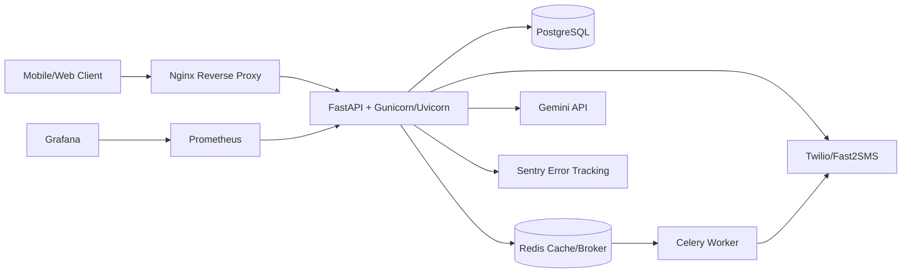

# NurtureHer Backend

NurtureHer is a production-ready FastAPI backend for an AI-powered women's health platform. It supports JWT authentication, role-based access control, mother wellness tracking, PCOS prediction, PPD assessment, multilingual AI health coaching, caregiver content, ASHA/ANM high-risk workflows, Redis caching, Celery background jobs, Prometheus metrics, and PostgreSQL persistence.

## Architecture



## Folder Structure

```text
app/
  api/                 Public API router modules
  api/routes/          Route implementations
  core/                Config, DB, auth, dependency injection
  models/              SQLAlchemy async models
  schemas/             Pydantic v2 schemas
  repositories/        Data access layer
  services/            Business logic and integrations
  middleware/          Logging, auth context, audit, sanitization
  ml/                  PCOS model loading and preprocessing
  analytics/           Mother and ASHA analytics
  monitoring/          Prometheus metrics
  workers/             Celery app and tasks
deploy/                Nginx, Kubernetes, Prometheus, Grafana
docs/                  OpenAPI, Postman, operations docs
scripts/               Seed and operations scripts
tests/                 Unit, integration, e2e, load scripts
```

## Environment Variables

Start from:

```bash
cp .env.example .env
```

For production:

```bash
cp .env.production.example .env
```

Important variables:

```text
DATABASE_URL
SYNC_DATABASE_URL
REDIS_URL
CELERY_BROKER_URL
CELERY_RESULT_BACKEND
JWT_SECRET_KEY
ENCRYPTION_KEY
BACKEND_CORS_ORIGINS
GEMINI_API_KEY
SMS_PROVIDER
TWILIO_ACCOUNT_SID
TWILIO_AUTH_TOKEN
TWILIO_FROM_NUMBER
FAST2SMS_API_KEY
SENTRY_DSN
```

## Run Locally

Install dependencies:

```bash
python -m pip install -r requirements.txt
# or
make install
```

Run PostgreSQL and Redis, then:

```bash
alembic upgrade head
uvicorn app.main:app --reload
# or
make migrate
make run
```

Seed data:

```bash
python scripts/seed.py
```

## Run With Docker

Development:

```bash
docker-compose up --build
```

Production:

```bash
docker compose -f docker-compose.prod.yml up --build -d
```

Production startup applies migrations, runs a strict configuration audit, and starts the hardened `app.production_main:app` entrypoint. Demo seeding is disabled by default; set `RUN_SEED_ON_STARTUP=true` only for controlled non-production demos.

Services:

```text
API through Nginx: http://localhost
API direct in dev: http://localhost:8000
Swagger docs: http://localhost:8000/docs
OpenAPI JSON: http://localhost:8000/openapi.json
Health: http://localhost:8000/health
Liveness: http://localhost:8000/live
Readiness: http://localhost:8000/ready
Metrics: http://localhost:8000/metrics
Prometheus: http://localhost:9090
Grafana: http://localhost:3000
```

## API Documentation

Generate OpenAPI:

```bash
python scripts/ops/generate_openapi.py
```

Artifacts:

- `docs/openapi.json`
- `docs/postman/NurtureHer.postman_collection.json`
- `docs/api_examples.md`
- `docs/er_diagram.md`

## AI And ML

PCOS prediction loads a trained RandomForest model from `app/ml/artifacts/pcos_random_forest.pkl`. If the artifact is absent, the API uses a calibrated rule-based fallback so development and tests remain runnable.

Train a model from CSV:

```bash
python -m app.ml.train_pcos --input data/pcos_training.csv --output app/ml/artifacts/pcos_random_forest.pkl
```

Required CSV columns:

```text
age,bmi,cycle_irregularity,hair_growth,skin_darkening,weight_gain,follicle_count,pcos
```

## Deployment Guide

Build production image:

```bash
docker build -f Dockerfile.prod -t nurtureher-api:prod .
```

Run production stack:

```bash
docker compose -f docker-compose.prod.yml up --build -d
```

Kubernetes:

```bash
kubectl apply -f deploy/k8s/configmap.yaml
kubectl create secret generic nurtureher-secrets --from-env-file=.env
kubectl apply -f deploy/k8s/api-deployment.yaml
kubectl apply -f deploy/k8s/worker-deployment.yaml
kubectl apply -f deploy/k8s/service.yaml
kubectl apply -f deploy/k8s/ingress.yaml
```

Replace `ghcr.io/OWNER/nurtureher-api:latest` and `api.example.com` in `deploy/k8s/*` before production use.

## Security

Implemented:

- JWT access tokens and Redis-backed refresh token rotation
- Bcrypt password hashing
- Password complexity policy
- RBAC dependencies
- CORS allow-listing
- SlowAPI rate limiting
- Input sanitization middleware
- Audit logging middleware
- AES-compatible encryption utility
- Environment-based secrets
- Sentry error tracking hook

Production checklist:

- Set strong `JWT_SECRET_KEY` and `ENCRYPTION_KEY`.
- Restrict `BACKEND_CORS_ORIGINS`.
- Configure SMS credentials for the selected `SMS_PROVIDER`; production sends fail closed when provider credentials are missing.
- Use a managed secrets store in production.
- Enable TLS at ingress/load balancer.
- Rotate SMS/Gemini credentials regularly.

## Database Operations

Migrations:

```bash
alembic revision --autogenerate -m "description"
alembic upgrade head
```

Current production migrations include `0002_production_indexes`, which adds composite indexes for timeline, alert, high-risk, audit, and role lookup queries.

Backup:

```powershell
.\scripts\ops\backup_db.ps1
```

Restore:

```powershell
.\scripts\ops\restore_db.ps1 -BackupFile .\backups\nurtureher_YYYYMMDD_HHMMSS.sql.gz
```

More detail:

- `docs/migration_strategy.md`
- `docs/backup_restore.md`

## Testing

Run tests:

```bash
pytest -q
# or
make test
```

The test suite enforces a minimum 80% coverage threshold via `pytest-cov`.

Lint:

```bash
ruff check .
# or
make lint
```

Load test:

```bash
locust -f tests/load/locustfile.py --host http://localhost:8000
```

Security scan locally:

```bash
pip install bandit pip-audit
bandit -r app
pip-audit -r requirements.txt
```

## CI/CD

GitHub Actions:

- `.github/workflows/ci.yml`: lint, tests, OpenAPI generation
- `.github/workflows/security.yml`: Bandit and dependency audit
- `.github/workflows/docker.yml`: production image build and GHCR push
- `.github/workflows/deploy.yml`: Kubernetes deployment workflow

Required deployment secret:

```text
KUBE_CONFIG
```

## Troubleshooting

Docker build cannot connect to database:

```bash
docker compose logs db
docker compose logs api
```

Migration failed:

```bash
docker compose exec api alembic current
docker compose exec api alembic upgrade head
```

Redis/Celery issues:

```bash
docker compose logs redis
docker compose logs worker
```

Metrics not showing:

```bash
curl http://localhost:8000/metrics
docker compose -f docker-compose.prod.yml logs prometheus
```

SMS not sending:

- Verify `SMS_PROVIDER`.
- Verify Twilio/Fast2SMS credentials.
- Check worker logs.
