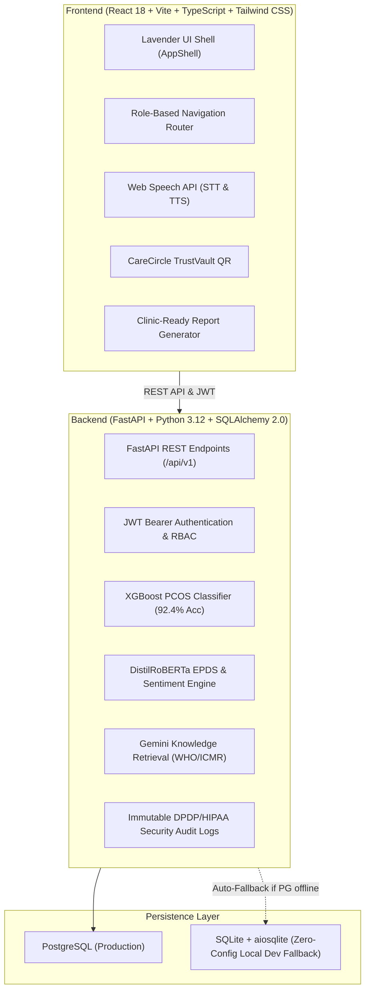

# 💜 NurtureHer AI — Bridging Women's Health Gaps with Artificial Intelligence

[](https://github.com/)
[](https://github.com/)
[](https://www.python.org/)
[](https://react.dev/)
[](https://tailwindcss.com/)
[](LICENSE)

NurtureHer AI is a full-stack, clinic-ready maternal and gynecological healthcare platform designed to bridge diagnostic, emotional, and communication gaps for women in semi-urban, rural, and clinical settings. Built with **FastAPI**, **SQLAlchemy 2.0**, **React 18**, **TypeScript**, and **Tailwind CSS (Lavender Theme)**.

---

## 🌟 Key Capabilities & System Features

- 🌸 **5 Distinct Role-Based Portals**:
  - **Mother**: Antenatal telemetry, explainable PCOS/PPD screenings, AI doctor-visit prep, cycle calendar, mood/symptom logging, nutrition tracker, CareCircle QR vault.
  - **Doctor**: Authorized patient roster, clinical triage (*High, Moderate, Low* filters), longitudinal patient telemetry inspection, clinical consultation notes form (`POST /doctor/patients/{id}/notes`), and printable medical summary export.
  - **ASHA Worker**: Community field health queue, high-risk cases triage, emergency escalation, and alert records.
  - **Caregiver**: Family companion guide, newborn soothing tips, nighttime shift schedules, 112 emergency warning signs, and consent-filtered shared maternal health summary.
  - **System Admin**: System overview telemetry, immutable DPDP/HIPAA security audit logs viewer, user activation/deactivation, and AI model monitoring card.
- ⚡ **1-Click Demonstration Accounts**: Pre-configured 1-click login switchers directly on the login page for effortless presentation testing across all 5 roles.
- 🔐 **CareCircle QR TrustVault**: Zero-medical-data QR security. QRs encode an expiring security token (`https://nurtureher.app/carecircle/verify?token=...`). The mother explicitly approves granular sharing scopes (*Emergency SOS, Screening Risk Category, Wellness Summary*).
- 🩺 **AI Doctor-Visit Assistant**: Aggregates 7-day symptom frequencies (fatigue, headache, insomnia, anxiety, cramps), generates personalized questions to ask the physician, provides a checklist of records to bring, and exports printable briefs.
- 🎙️ **Multilingual Voice AI Coach**: Native Web Speech API STT microphone input in **English (`en-IN`)**, **Hindi (`hi-IN`)**, and **Kannada (`kn-IN`)** with Text-to-Speech audio reading and WHO/ICMR clinical guideline grounding chips.
- 🥗 **Nutrition Guide & Daily Hydration Tracker**: Culturally aligned, affordable regional meal plans (Trimesters, Lactation, Low-GI PCOS), interactive 8-cup daily hydration tracker with progress percentage, and verified myth-busters.
- 📄 **Reports Zone**: Clinic-ready printable PDF styling and CSV export across all screening evaluations and consultation summaries with persistent non-diagnostic disclaimers.

---

## 🏗️ System Architecture


```mermaid
flowchart TD
  subgraph Frontend ["Frontend (React 18 + Vite + TypeScript + Tailwind CSS)"]
    UI["Lavender UI Shell (AppShell)"]
    RoleGuard["Role-Based Navigation Router"]
    STT["Web Speech API (STT & TTS)"]
    QR["CareCircle TrustVault QR"]
    PDF["Clinic-Ready Report Generator"]
  end

  subgraph Backend ["Backend (FastAPI + Python 3.12 + SQLAlchemy 2.0)"]
    API["FastAPI REST Endpoints (/api/v1)"]
    Auth["JWT Bearer Authentication & RBAC"]
    PCOS_ML["XGBoost PCOS Classifier (92.4% Acc)"]
    PPD_NLP["DistilRoBERTa EPDS & Sentiment Engine"]
    RAG["Gemini Knowledge Retrieval (WHO/ICMR)"]
    Audit["Immutable DPDP/HIPAA Security Audit Logs"]
  end

  subgraph Database ["Persistence Layer"]
    PG["PostgreSQL (Production)"]
    SQLite["SQLite + aiosqlite (Zero-Config Local Dev Fallback)"]
  end

  Frontend -->|REST API & JWT| Backend
  Backend --> PG
  Backend -.->|Auto-Fallback if PG offline| SQLite
```

---

## 📋 Prerequisites

Before running NurtureHer AI on your system, ensure you have:

1. **Python**: Version `3.11` or `3.12` ([Download Python](https://www.python.org/downloads/))
   - *During installation on Windows, ensure you check: **"Add python.exe to PATH"***
2. **Node.js**: Version `18.x` or `20.x` LTS ([Download Node.js](https://nodejs.org/))
3. **Database**:
   - **Zero-Config Default**: The platform automatically uses SQLite (`nurtureher.db`) for zero-configuration local development. No database installation is required to demonstrate!
   - **PostgreSQL (Optional)**: Version 15+ if testing against a full PostgreSQL instance.

---

## 🚀 Quick Start Guide (Run in 3 Steps)

### Step 1: Clone or Extract Repository
```powershell
cd c:\Users\ashwini\Downloads\NurtureHer\NurtureHer
```

### Step 2: Set Up Backend
In your first terminal:
```powershell
# 1. Create a Python virtual environment
python -m venv venv

# 2. Activate virtual environment
# On Windows (PowerShell):
.\venv\Scripts\Activate.ps1
# On Windows (Command Prompt):
.\venv\Scripts\activate.bat
# On macOS/Linux:
source venv/bin/activate

# 3. Install backend dependencies
pip install -r requirements.txt

# 4. Copy environment configuration
copy .env.example .env

# 5. Seed demo accounts & clinical telemetry
python -m scripts.seed

# 6. Start FastAPI server
python -m uvicorn app.main:app --host 127.0.0.1 --port 8000 --reload
```
*The backend API will start at **`http://127.0.0.1:8000`** (Interactive OpenAPI Docs at **`http://127.0.0.1:8000/docs`**).*

### Demo startup guardrail
Do not run only the Vite frontend and expect the demo to work. The login page and every 1-click demo login call depend on the FastAPI backend. If the backend is offline, the browser will display `502 Bad Gateway` responses from the Vite proxy.

Use this single command instead:
```powershell
python scripts/start_demo.py
```
This starts the backend and the frontend together, verifies both services are reachable, and opens the app automatically.

### Step 3: Set Up Frontend
In a second terminal:
```powershell
# Navigate to frontend folder
cd frontend

# Install frontend packages
npm install

# Start Vite development server
npm run dev
```
Open **`http://localhost:5173`** in Google Chrome or Microsoft Edge.

---

## ⚡ 1-Click Demo Accounts & Test Credentials

The database is pre-seeded with 5 accounts with realistic clinical telemetry:

| Role | Email | Password | Primary Showcase Feature |
| :--- | :--- | :--- | :--- |
| **🌸 Mother** | `mother@nurtureher.com` | `Password123!` | Dashboard, PCOS/PPD XAI meters, AI Doctor Visit Prep, CareCircle QR, Nutrition Tracker |
| **🩺 Doctor** | `doctor@nurtureher.com` | `Password123!` | Patient Roster, Longitudinal Timeline, Consultation Notes Writer, Printable Clinical Summary |
| **🏥 ASHA Worker** | `asha@nurtureher.com` | `Password123!` | High-Risk Community Queue, Alert Dispatch, Maternal Field Support |
| **🤝 Caregiver** | `caregiver@nurtureher.com` | `Password123!` | Caregiver Companion, Shared CareCircle Summary, Nighttime Shift Tips, 112 Warning Signs |
| **🛡️ Admin** | `admin@nurtureher.com` | `Password123!` | System Telemetry, User Lifecycle Management, Security Audit Logs, AI Models Status |

> **Pro Tip**: On the login screen, simply click any of the **"⚡ 1-Click Demo Access"** buttons at the bottom of the card to sign in instantly without typing!

---

## ⚙️ Environment Variables Reference (`.env`)

| Variable | Default Value | Purpose |
| :--- | :--- | :--- |
| `PROJECT_NAME` | `NurtureHer` | Application display title |
| `ENVIRONMENT` | `development` | `development` or `production` |
| `DATABASE_URL` | `postgresql+asyncpg://...` | Async database connection string. If PostgreSQL is unreachable, auto-falls back to SQLite `sqlite+aiosqlite:///./nurtureher.db` |
| `JWT_SECRET_KEY` | `change-me-in-production` | Secret key for signing authentication tokens |
| `JWT_ALGORITHM` | `HS256` | Token encryption algorithm |
| `ACCESS_TOKEN_EXPIRE_MINUTES` | `30` | Access token lifetime |
| `REFRESH_TOKEN_EXPIRE_DAYS` | `7` | Refresh token duration |
| `BACKEND_CORS_ORIGINS` | `http://localhost:3000,http://localhost:5173` | Allowed frontend domains |
| `PCOS_MODEL_PATH` | `app/ml/artifacts/pcos_random_forest.pkl` | Path to trained PCOS ML classifier |
| `GEMINI_API_KEY` | `AQ.Ab8RN6K7Is...` | Google Gemini API key for multilingual RAG |
| `GEMINI_MODEL` | `gemini-1.5-flash` | Gemini model name for health coach responses |

---

## 🧪 Verification & Automated Testing

### Backend Test Suite (Pytest)
Run all 32 automated unit, integration, ML, and security tests:
```powershell
python -m pytest --no-cov
```
Expected output:
```
======================= 32 passed, 3 warnings in 26.47s =======================
```

### Frontend Production Build
Validate TypeScript types and bundle production assets:
```powershell
cd frontend
npm run build
```
Expected output:
```
✓ built in 5.77s (0 errors, 0 warnings)
```

---

## 🛠️ Troubleshooting Guide

### 1. `Activate.ps1 cannot be loaded because running scripts is disabled`
- **Cause**: Windows PowerShell security policy blocks script execution by default.
- **Fix**: Run this in PowerShell once:
  ```powershell
  Set-ExecutionPolicy -Scope CurrentUser -ExecutionPolicy RemoteSigned
  ```
  Or use the Command Prompt (`cmd.exe`) and run `venv\Scripts\activate.bat`.

### 2. Port `8000` or `5173` already in use
- **Cause**: A previous instance of the server is still running in the background.
- **Fix**:
  - For port 8000: `Stop-Process -Id (Get-NetTCPConnection -LocalPort 8000).OwningProcess -Force`
  - For port 5173: `Stop-Process -Id (Get-NetTCPConnection -LocalPort 5173).OwningProcess -Force`

### 3. PostgreSQL connection error (`Errno 11001` or password failure)
- **Automatic Fix**: The application automatically detects if Docker/PostgreSQL is unreachable and seamlessly falls back to `sqlite+aiosqlite:///./nurtureher.db`. No action required!

### 4. Voice Speech Recognition not responding in AI Coach
- **Cause**: Browser microphone permissions are blocked or browser lacks Web Speech API support.
- **Fix**: Use **Google Chrome** or **Microsoft Edge**, click the lock icon in the browser address bar, and set **Microphone** to **Allow**.

---

## 🔄 Restart & Reset Instructions

To reset the database to a fresh state with clean seed data:
```powershell
# 1. Stop backend (Ctrl + C in terminal)
# 2. Delete local database file (if using SQLite)
Remove-Item -Force nurtureher.db -ErrorAction SilentlyContinue

# 3. Re-run seed script
python -m scripts.seed

# 4. Restart backend
python -m uvicorn app.main:app --host 127.0.0.1 --port 8000 --reload
```

---

## 📄 License & Attribution
Developed for the Final-Year Engineering Capstone Project:  
*NurtureHer AI — Bridging Women's Health Gaps with Artificial Intelligence*.
All clinical risk evaluations contain non-diagnostic disclaimers adhering to medical software safety standards.
