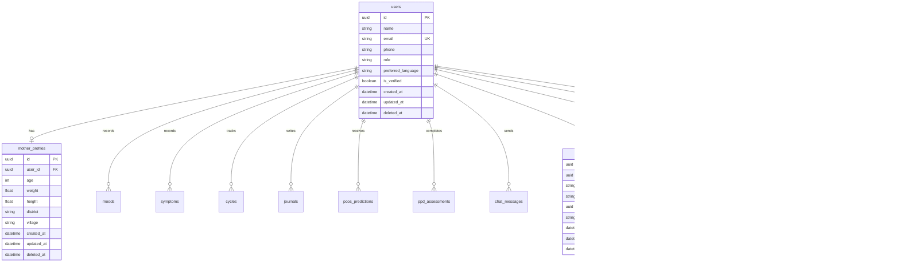

# NurtureHer ER Diagram

```mermaid
erDiagram
  users ||--o| mother_profiles : has
  users ||--o{ moods : records
  users ||--o{ symptoms : records
  users ||--o{ cycles : tracks
  users ||--o{ journals : writes
  users ||--o{ pcos_predictions : receives
  users ||--o{ ppd_assessments : completes
  users ||--o{ chat_messages : sends
  users ||--o{ high_risk_cases : flagged
  users ||--o{ alerts : receives
  users ||--o{ refresh_tokens : owns
  users ||--o{ audit_logs : performs

  users {
    uuid id PK
    string name
    string email UK
    string phone
    string role
    string preferred_language
    boolean is_verified
    datetime created_at
    datetime updated_at
    datetime deleted_at
  }

  mother_profiles {
    uuid id PK
    uuid user_id FK
    int age
    float weight
    float height
    string district
    string village
    datetime created_at
    datetime updated_at
    datetime deleted_at
  }

  high_risk_cases {
    uuid id PK
    uuid user_id FK
    string risk_type
    string risk_level
    uuid assigned_worker_id FK
    string status
    datetime created_at
    datetime updated_at
    datetime deleted_at
  }

  alerts {
    uuid id PK
    uuid user_id FK
    text message
    string sent_status
    datetime sent_at
    datetime created_at
    datetime updated_at
    datetime deleted_at
  }

  refresh_tokens {
    uuid id PK
    uuid user_id FK
    string token_jti UK
    datetime expires_at
    datetime revoked_at
  }
```

